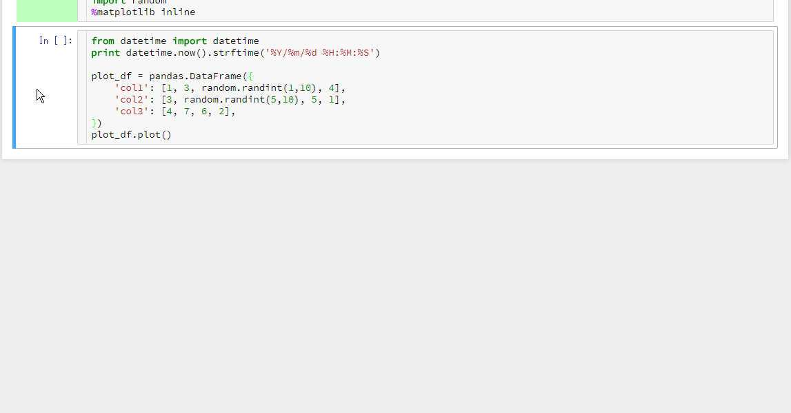
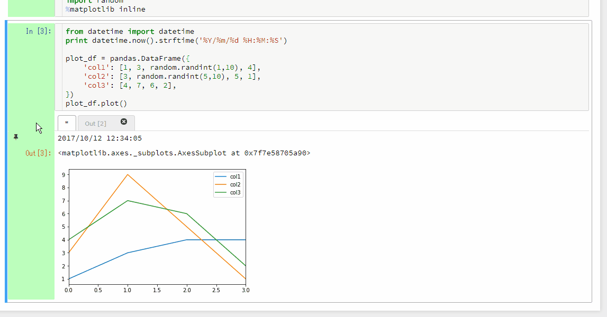

# Introduction

This extension enables to keep multiple results as tabs in output_area.
You can also save/load tabbed outputs as far as this extension is enabled
As default behavior the "output_area" under a code cell is cleared and over written in each execution.  

# Feature

* Pin button for saving outputs
* Visualization of each code cell's executing status with colors
* Diff dialog for comparing pinned outputs with current outputs
* Search feature in the diff dialog

# How to install

To install the multi_outputs extension, the following steps are required.

## Install the python package

Install the `lc_multi_outputs` python package.

```
pip install git+https://github.com/NII-cloud-operation/Jupyter-multi_outputs
```

## Install extension files

Copy the nbextension files into the jupyter server's search directory.

```
jupyter nbextension install --py lc_multi_outputs --user
```

About details of `jupyter nbextension` subcommand, execute this command with `--help` option, and see the results.

```
jupyter nbextension --help
```

## Enabling extension

To use the multi_outputs extension, you will also need to enable it.

```
jupyter nbextension enable --py lc_multi_outputs --user
```

# Usage

## Save current outputs

1. Execute a code cell
2. Select the current output (leftmost) tab (if output tabs exist)
3. Click the pin button in the output prompt area



## Execution status color of code cell

The prompt area of code cell displays execution status with colors.
The colors mean as follows:

- White: Not Executed
- Light cyan: Awaiting Execution
- Green: Successfully Executed
- Pink: Failed

## Diff dialog

You can compare pinned output with current output.

1. Select the pinned output tab you want to compare with current output
2. Click the diff button in the output prompt area

You can search keyword from the outputs compared in the diff dialog.
To search, input keyword to the search field and press the Enter key.



# Internals

The pinned outputs are saved as cell metadata.

This is an example of a code cell
```
{
 "cell_type": "code",
 "execution_count": 2,
 "metadata": {
  "pinned_outputs": [
   {
    "execution_count": 1,
    "outputs": [
     {
      "data": {
       "text/plain": "'2017/10/12 13:36:42'"
      },
      "execution_count": 1,
      "metadata": {},
      "output_type": "execute_result"
     }
    ]
   }
  ]
 },
 "outputs": [
  {
   "data": {
    "text/plain": [
     "'2017/10/12 13:36:49'"
    ]
   },
   "execution_count": 2,
   "metadata": {},
   "output_type": "execute_result"
  }
 ],
 "source": [
  "from datetime import datetime\n",
  "datetime.now().strftime('%Y/%m/%d %H:%M:%S')"
 ]
}
```

# License

This project is licensed under the terms of the Modified BSD License (also known as New or Revised or 3-Clause BSD), see LICENSE.txt.
